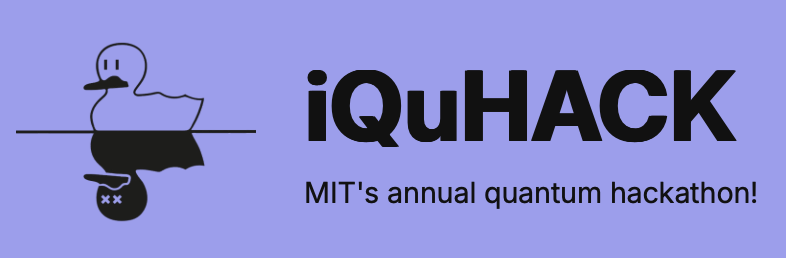
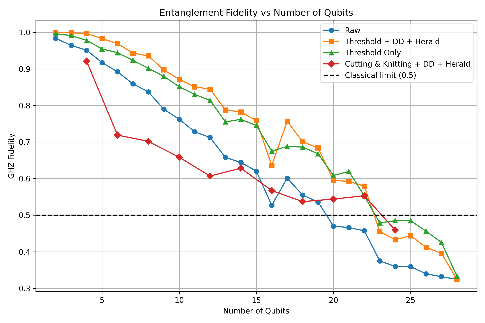

# iQuHACK 2026 • IQM Challenge • Witness My Entanglement!

**Team name:** Team 17

**Members:** Andrew Maciejunes | Jesse Webb | Andrew Norway | Vlad Gaylun | Andrei Chupakhin

See all details in presentation [Team_17_iQuHACK_2026.pdf](./Team_17_iQuHACK_2026.pdf)

## Key ideas

## How to Use This Repository

1. First, start an instance on [qBraid](https://account.qbraid.com).
2. Go back to this repository and click on the `Launch on qBraid` button. You will be redirected to qBraid (repository cloning might take up to 5 minutes).
3. When the repository is cloned, on qBraid open the Jupyter Notebook [start_here.ipynb](./start_here.ipynb) and follow the instructions inside.
4. You're all set!

## Our Results

